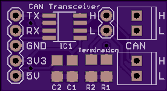
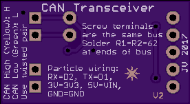

# CAN Bus Transceiver Breakout

Connect microcontrollers together with CAN bus.

- [Schematics](CAN-breakout-v2.pdf)
- [Bill of materials](CAN-breakout-v2_BOM.csv)
- [Order on OSH Park](https://oshpark.com/shared_projects/lQWzjZzS)

## License

Copyright 2017 Julien Vanier
Released under the MIT license
